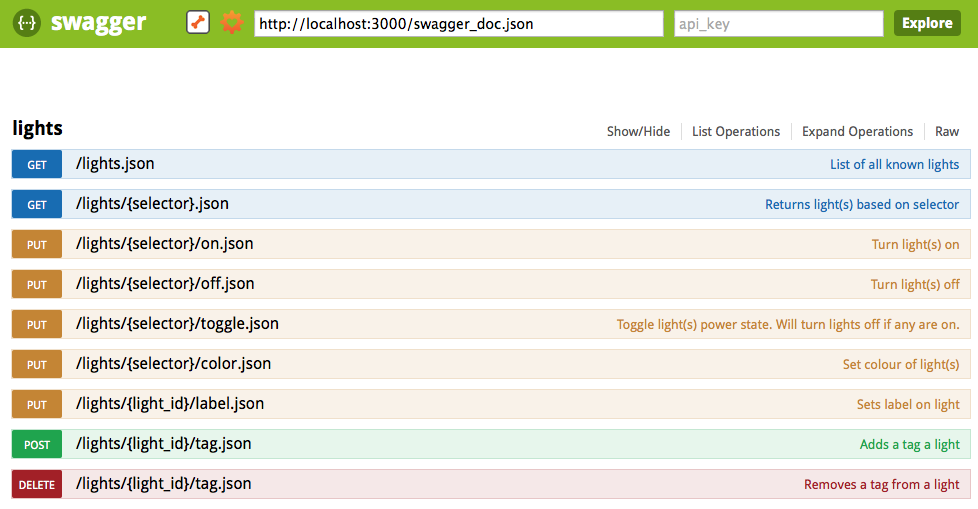

# LIFX HTTP API

 

This is an **unofficial** JSON RESTful API service for controlling LIFX devices. This API adds some reliability that the [LIFX gem](https://github.com/LIFX/lifx-gem) does not include.

## Features

* Mostly synchronous, apart from setting colour
* Supports MDNS

## Requirements

* Ruby 2.0+
* Tested on OS X Mavericks, but should work for other *nix platforms.

## Usage

* Install the gem: `gem install lifx-http`
  * On OS X Mavericks using system Ruby: `sudo gem install lifx-http`
    * If you see this: `clang: error: unknown argument: '-multiply_definedsuppress' [-Wunused-command-line-argument-hard-error-in-future]`
      Run `export ARCHFLAGS=-Wno-error=unused-command-line-argument-hard-error-in-future; sudo -E gem install lifx-http`
* Run in foreground (no daemonizing yet): `lifx-http`
* Test if working: `curl http://localhost:56780/lights.json`
* Toggle all lights: `curl -XPUT http://localhost:56780/lights/all/toggle -d ''`
* Set all lights to green:
  * URL params: `curl -XPUT "http://localhost:56780/lights/all/color?hue=120&saturation=1&brightness=1&duration=2" -d ''`
  * JSON body: `curl -XPUT http://localhost:56780/lights/all/color -H "Content-Type: application/json" -d '{"hue": 120, "saturation": 1, "brightness": 1, "duration":2}'`
  * Override method by setting `_method`: `curl "http://localhost:56780/lights/all/color?hue=120&saturation=1&brightness=1&duration=2&_method=put"`
* Start a slow sunrise effect:
  * `curl -XPUT "http://localhost:56780/lights/all/color?hue=35&saturation=0.37&brightness=0.65&duration=10m" -d ''`

## API

* `selector` is either:
  * `all` for all lights
  * `label:[label]` for light with label `label`
  * `tag:[tag]` for lights with tag `tag`
  * `[light_id]` for light with id `light_id`
* `GET /lights` - Lists all lights
* `GET /lights/{selector}` - Lists lights matching `selector`
* `PUT /lights/{selector}/on` - Turns lights matching `selector` on
* `PUT /lights/{selector}/off` - Turns lights matching `selector` off
* `PUT /lights/{selector}/toggle` - Toggle lights matching `selector`. If any lights in `selector` is on, it will turn them off
* `PUT /lights/{selector}/color` - Sets the color for lights matching `selector`. Color data can be passed as URL parameters or form parameters (JSON)
* `PUT /lights/{light_id}/label` - Changes the label of light with id `light_id`
* `POST /lights/{light_id}/tag` - Adds a tag to the light
* `DELETE /lights/{light_id}/tag` - Removes a tag from the light

## Documentation

This API is documented using [Swagger](https://github.com/wordnik/swagger-ui).
To view documentation and play with the API, start the API server locally, then visit http://swagger.wordnik.com and put `http://localhost:3000/swagger_doc.json` in the first text box, then hit `Explore`.

You should see something like this:

## Changelog

#### 0.2.3

- Update MDNS gem

#### 0.2.2

- MDNS fix

#### 0.2.1

- Duration now supports minute and hour suffixes e.g. "12h" for 12 hours thanks to @Bluebie
- MDNS support! Enables easy discovery of a LIFX HTTP instance on the LAN.

#### 0.2.0

- First gem release

## License

MIT. See [LICENSE](LICENSE)
